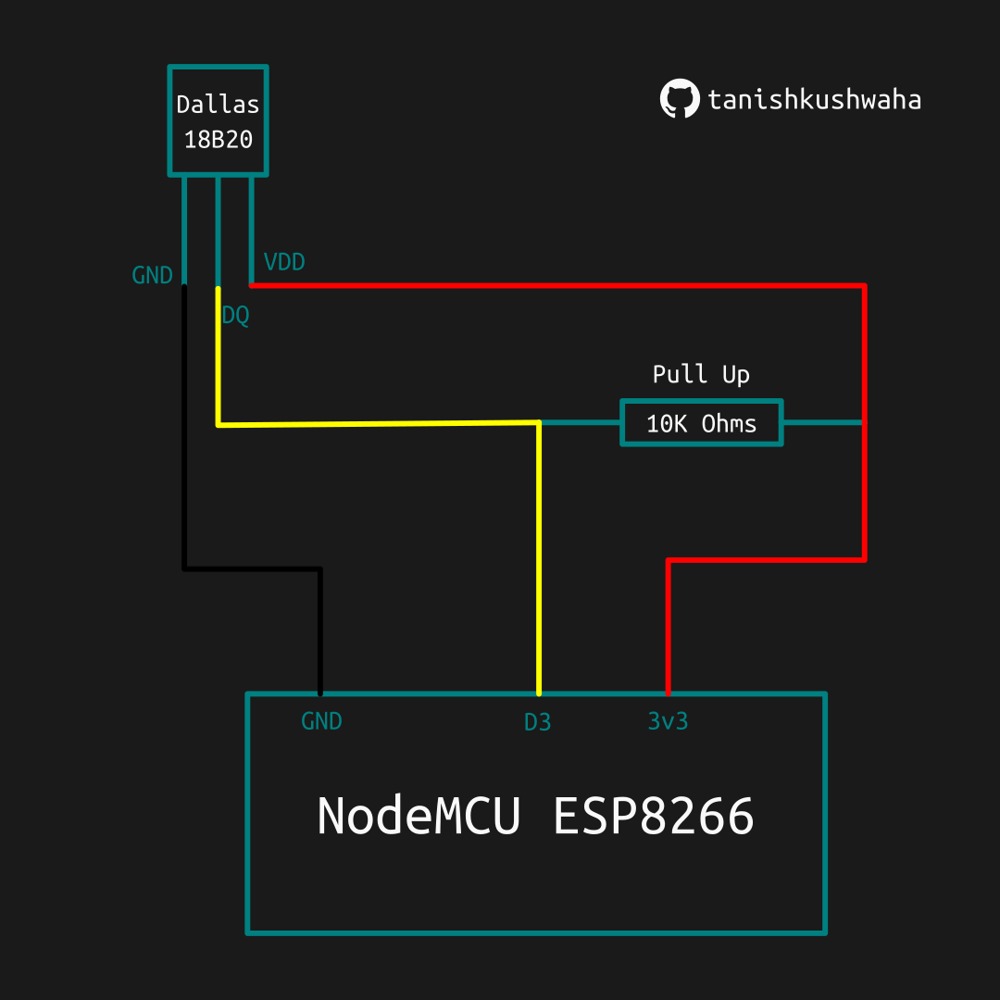

# Thermal Monitor

A simple real-time temperature monitoring system in which an ESP8266 NodeMCU acts as a WebSocket server, continually sending temperature data to a React app acting as the WebSocket client. The system allows you to monitor the local environment's temperature remotely in real-time.

## Images

### Circuit Diagram

### Desktop

### Phone

